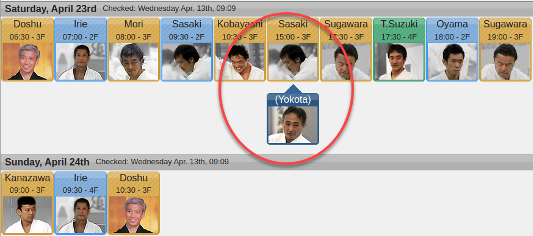
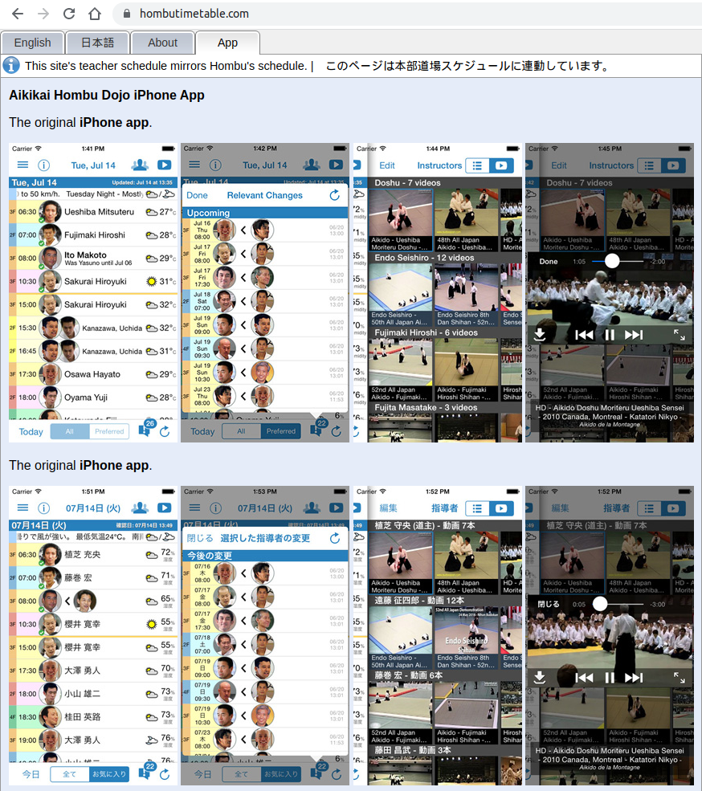
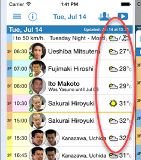
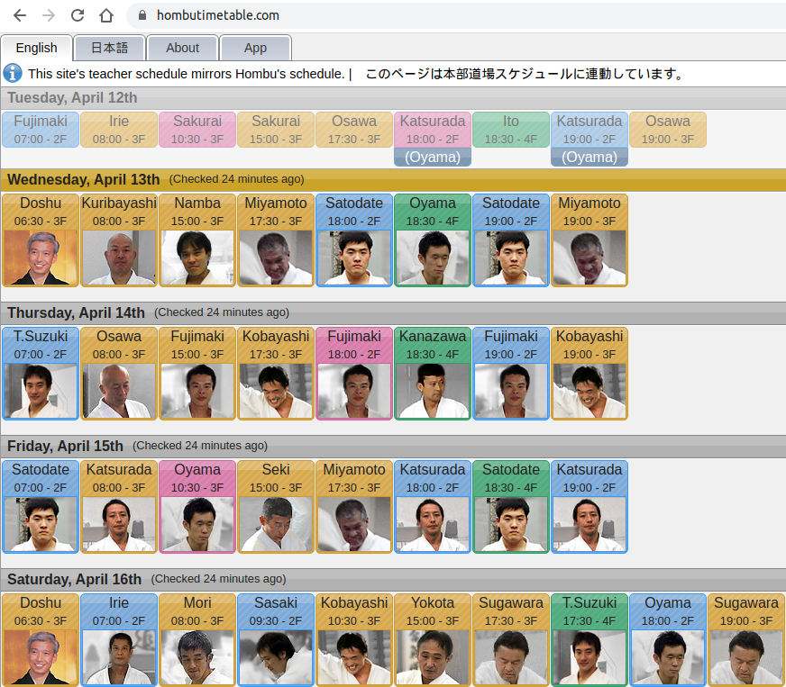
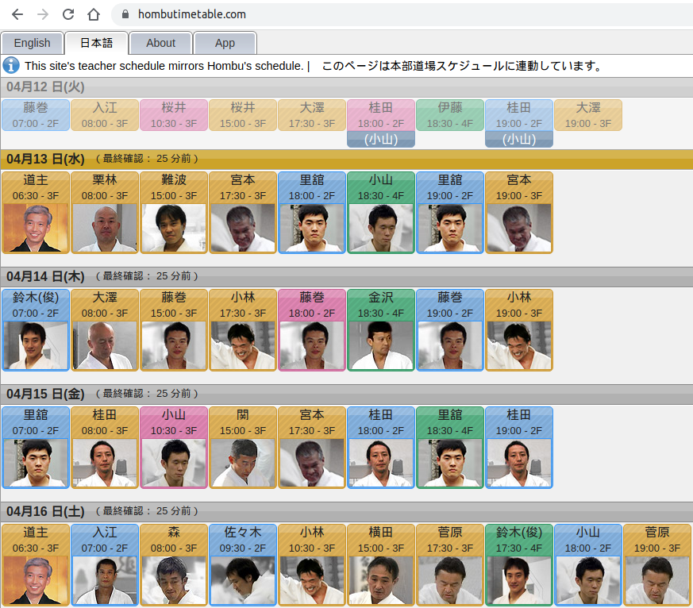
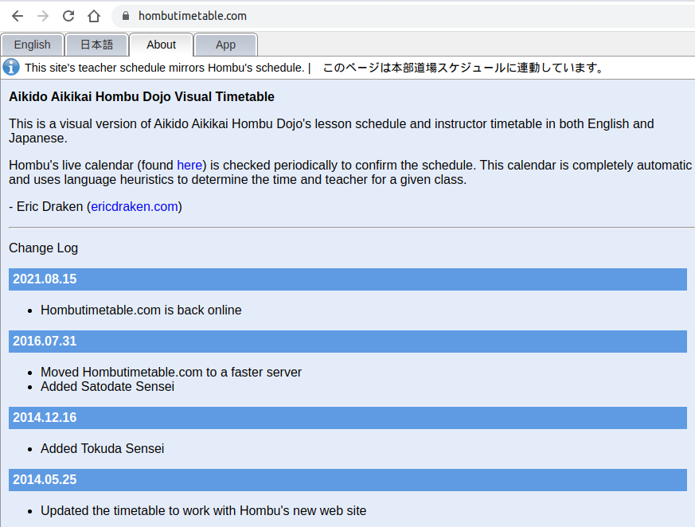

# Source Code for Hombutimetable.com

From 2012 to 2022, this was a visual version of Aikido Aikikai Hombu Dojo's lesson schedule and instructor timetable in both English and Japanese.

Hombu's live calendar (found [here](http://aikikai.or.jp/information/practiceleader.html)) was checked periodically to confirm the schedule. This calendar was completely automatic and uses language heuristics to determine the time and teacher for a given class.

For years in Tokyo, Japan, I'd try to take five one-hour classes a day - five hours of practice a day. There are two floors. Some of my favourite shihans would drop in as replacements, so I wanted to be sure I selected the right floor for training and didn't miss them!

### Schedule Change Tracker

The schedule was usually fluid, and to avoid surprises, I wrote this site to keep me updated on changes like the following:



### Handle Strange Data Input

Whoever worked in the front office, or updated the schedule, would often input strange date formats, or leave their keyboard set to Japanese when entering English information. Part of the fun of this website was adding heuristics to guess what the administrator meant. Why are some dates `2011/04/02` and others `2011-04-02` or just `04-02`? Also, the entered encoding might not have been UTF-8.

```
/**
 * Hombu sometimes uses EUC which really messes up DBs and everything, really.
 */ 	
static public function eucToUtf($str) {
    return mb_convert_encoding($str, "UTF-8", "EUC-JP");		
}
```

### iOS App

Eventually, I made an iOS app that could switch between Japanese and English on the fly. It also downloaded YouTube videos, so they could be played in the app. I think it was novel at the time how I tricked YouTube into downloading videos locally. I also added a slowmo feature and zoom. Today, this is very against the ToS of Apple and YouTube, but those were very good times!



### Weather Reports

I then hooked in weather from Wunderground so I'd know if I needed an umbrella for 6:30 am practice.



### Push Messages

The last feature was **push messaging** so iOS app users would know within 5 minutes of a schedule change for the day.

### Teacher Photos

I had to be creative with teacher photos too. I tried to get the coolest photos I could from videos and made each of the teachers shine. This is how I saw them each and every day in Tokyo. Doshu was in color because, well, he's Doshu!


### Final Thoughts

It is wild to think that this project scraped data, saved it, compared it with past data, used heuristics on dates and even names, downloaded YouTube videos, aggregated weather information, had push notifications, and kept all the data cached in BitBucket for fast access. This was a labor of love while I was writhing in soreness, on the floor, in Tokyo, between classes at Hombu.

---







---

## How to Use

I literally have no idea anymore, plus I haven't touched PHP in years. I trust you will do your level best from the comments in my source code to figure out what is going on.

Cheers,
Eric
